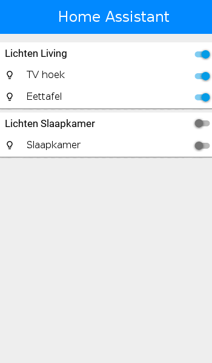

# Homeassistant UI Display
This is a UI for [home-assistant](http://home-assistant.io) i've 
written for own use. It's main purpose is to be able to control
home-assistant from a pi with a touchscreen mounted on the wall.

This project uses [pygame](http://pygame.org) as backed & the awesome
[pgu](https://github.com/parogers/pgu) for the GUI. Using a custom theme
& UI elements, I've tried to mimmick the web ui of home-assistant.

## Screenshot


## features
* displaying group items
* switching on/off of lights
* displaying sensor data
* Uses EventStream (`/api/stream`) for streaming updates
* Using `icon_font_to_png` to use the Material Design Icon font on the fly.
* Cool

## Install instructions
### Home Assistant

Yes, you'll need to install Home Assistant. Don't worry you don't have to run it! We need it for its remote & core class.
Just do:

```bash
pip3 install homeassistant
```

### pygame on python3

Currently, to my knownledge, there are no known packages pygame on python3

You'll have to compile pygame(1.9.2) from source. Luckly, this isn't that hard.

```bash
# install these packages for ubuntu/debian
sudo apt install python3-pip python3-dev libsdl-image1.2-dev libsdl-mixer1.2-dev  libsdl-ttf2.0-dev libsdl1.2-dev libsmpeg-dev python-numpy subversion  libportmidi-dev
# clone using mercury
hg clone https://bitbucket.org/pygame/pygame
cd pygame
pip3 install .
```

### pgu on python3

See above, install from source
```bash
# get the source from github
git clone https://github.com/parogers/pgu
cd pgu
pip3 install .
```

### HUD
place it somewhere. Execute hud.py & enjoy!

## Configuration

HUD needs a configuration file, ini-style. For Example:

```ini
[HomeAssistant]
Host = localhost
Port = 8123
Key = my-secret-password
SSL = False
[lights]
group=lichten_living
```

The first one speeks for itself, home assistant configuration.

The second one is a group definition. it needs an group entity name
(for ex. if you have `group.lichten_living` enter `lichten_living`)
There can be as many sections as you want, if you have at least one
HomeAssistant section.


Enjoy!