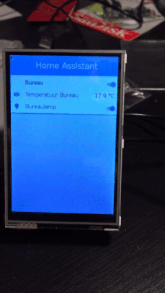

# Homeassistant UI Display
This is a UI for [home-assistant](http://home-assistant.io) i've
written for own use. It's main purpose is to be able to control
home-assistant from a pi with a touchscreen mounted on the wall.

This project uses [pygame](http://pygame.org) as backed & the awesome
[pgu](https://github.com/parogers/pgu) for the GUI. Using a custom theme
& UI elements, I've tried to mimmick the web ui of home-assistant.

## Screenshot



## features
* displaying group items
* switching on/off of lights
* displaying sensor data
* Uses EventStream (`/api/stream`) for streaming updates
* Using `icon_font_to_png` to use the Material Design Icon font on the fly.
* Cool

## Install
```bash
git clone https://github.com/subutux/HUD
# Install using pip
sudo pip3 install .

# run the help
hud --help
```

## Configuration

HUD needs a configuration file, ini-style. For Example:

```ini
[HomeAssistant]
Host = your.external.homeassistant.host
Port = 443
Key = my-secret-password
SSL = True
[lights]
group=lichten_living
```

The first one speaks for itself, home assistant configuration.

The second one is a group definition. it needs an group entity name
(for ex. if you have `group.lichten_living` enter `lichten_living`)
There can be as many sections as you want, if you have at least one
HomeAssistant section.

## Auto start

When running on a pi, you probably want to auto start hud.
When installing hud, there are some extra files installed:

- /etc/systemd/system/hud.service

  A systemd service for starting up HUD
- /etc/default/hud.opts

  Your command line parameters for HUD
- /usr/local/sbin/hud.init

  a workaround for a problem with sseclient in systemd

About that last one,This is a work around for a nasty problem with
SSEClient/requests. The problem was that the requests with
'stream=True' would'nt initialize when hud is run directly from
systemd.

For some weird reason running hud from this bash'wrapper' fixes
the annoyance.

If someone has any idea why this is, let me know. I'm eager to know.


### Enabling service

To enable the service, run:

```bash
sudo systemctl enable hud.service
sudo systemctl daemon-reload
```

## Arguments
```
usage: hud [-h] -c CONFIG [-f /dev/fbX] [-t /dev/input/eventX] [-n]
           [-H host.name] [-p PORT] [-k KEY] [-s] [-v]
           [-L {INFO,WARNING,ERROR,CRITICAL,DEBUG}] [-l LOGFILE]

A pygame GUI for Home Assistant.

optional arguments:
  -h, --help            show this help message and exit

Configuration:
  -c CONFIG, --config CONFIG
                        config file to use
  -f /dev/fbX, --framebuffer /dev/fbX
                        Use this framebuffer as output for the UI (defaults to
                        window mode)
  -t /dev/input/eventX, --touchscreen /dev/input/eventX
                        Enable touchscreen integration. Use this as event
                        input
  -n, --no-display      We don't have a display. Sets the SDL_VIDEODRIVER to
                        "dummy". Usefull for testing

HomeAssistant:
  (optional) Parameters to override the config file

  -H host.name, --homeassistant host.name
                        The location of home-assistant
  -p PORT, --port PORT  the port to use for home-assistant (default: 8123)
  -k KEY, --key KEY     The api password to use (default: None)
  -s, --ssl             Use ssl (default false)

Logging:
  (optional) Logging settings

  -v, --verbose         Log output
  -L {INFO,WARNING,ERROR,CRITICAL,DEBUG}, --logLevel {INFO,WARNING,ERROR,CRITICAL,DEBUG}
                        Log level to use (default: ERROR)
  -l LOGFILE, --logfile LOGFILE
                        Instead of logging to stdout, log to this file
```
## Disclamer

Don't look at the code, it's ugly! You're always welcome to post a pull request
to make the code cleaner, or just give me some pointers. I love to learn more!
